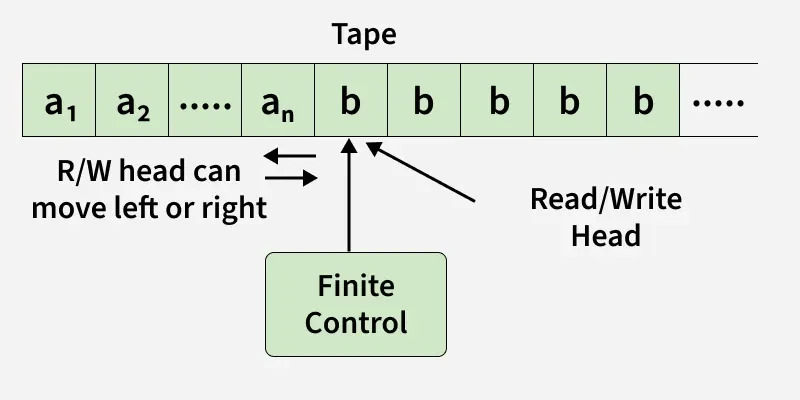
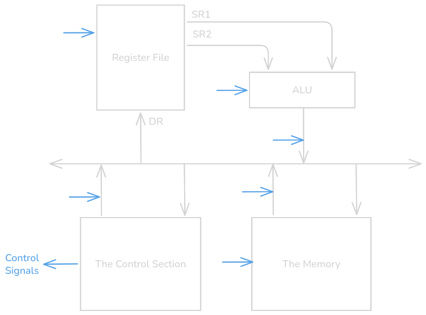
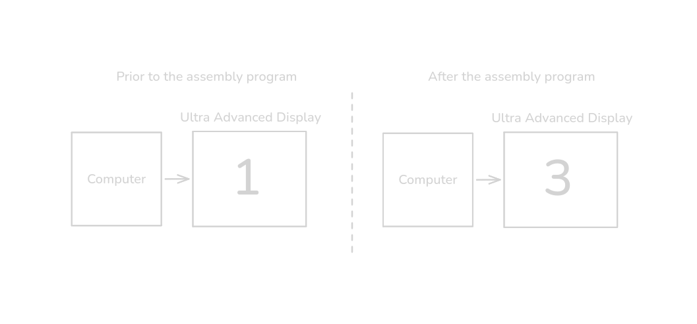
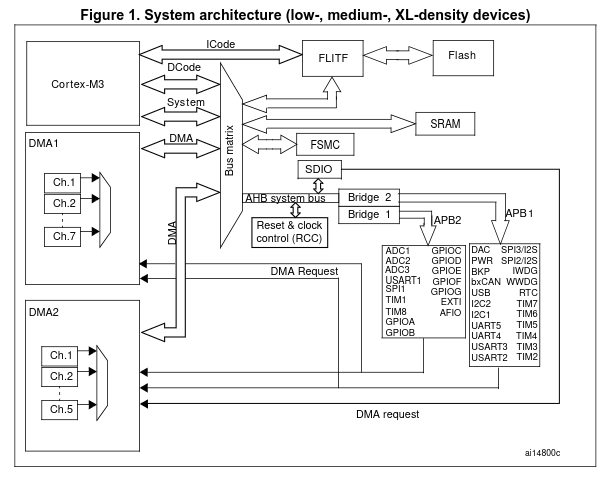
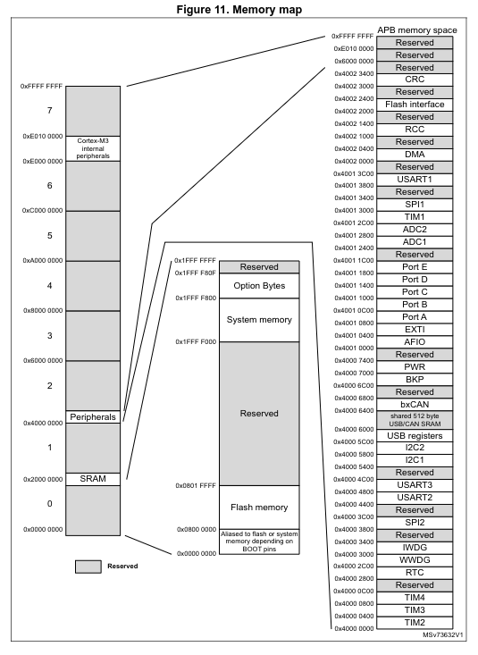
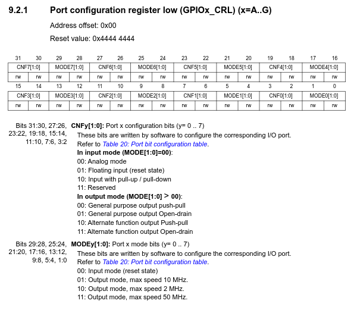
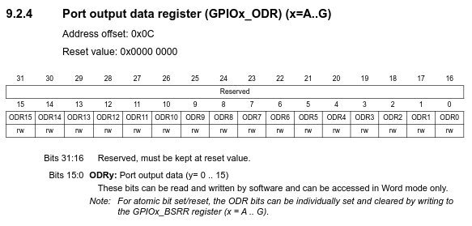

The Answer
---


```asm
    LDR R0, =GPIOA_CRL
    LDR R0, [R0]
    LDR R1, [R0]
    MOVS R2, 0xf
    BICS R1, R2
    MOVS R2, 0b001
    ORRS R1, R2
    STR R1, [R0]

    LDR R0, =GPIOA_ODR
    LDR R0, [R0]
    MOVS R2, #1
loop:
    LDR R1, [R0]
    EORS R1, R2
    STR R1, [R0]
    BL delay_100ms
    B loop

```

<!-- pause -->
Questions?
<!-- end_slide -->

The more nuanced answer
---

<!-- incremental_lists: true -->

To blink an LED with a computer you need to understand the following things

- How a computer works
- How a computer changes its state
- How a computer interacts with the world

<!-- end_slide -->

Why you should care
--

<!-- incremental_lists: true -->

If you can just use an Arduino or a HAL (Hardware Abstraction Library) why
should I care about assembly?

- Interfacing with sensors is a lot like interfacing with a computer
- Debugging is easier if you know what's going on with the hardware
- If you understand these principles you can use any microcontroller
- You can also plan and design better if you know what's actually going on

<!-- end_slide -->

What is a computer?
---


At it's most basic a computer is a machine that reads instructions from a memory
and performs them, updating the computer's state and other items in memory.



<!-- alignment: center -->
_Turing's Model of a Computer_

<!-- end_slide -->

What is an instruction?
---

I like to think of an instruction as the most basic operation that a computer can execute.

<!-- pause -->

For example, multiplying numbers can be an instruction if there is a multiply unit in your computer's hardware.

<!-- pause -->

Finding the factorial of a number is NOT an instruction because there is no factorial unit in your computer's hardware.
Instead, a programmer must find a factorial by using a combination of actual instructions.

<!-- pause -->

Computer architecture nerds will tell you that an instruction is a contract given to the programmer, and it is how we update
the state of the computer.

<!-- pause -->

What's included in the state of the computer?

<!-- incremental_lists: true -->

- Registers (small pieces of hardware that hold temporary variables) *IMPORTANT*
- Current Instruction
- Status Bits
- Hidden State

<!-- end_slide -->

An Example of an Instruction
---

The following instruction adds the contents of two registers, storing the result
into the destination register

```asm
ADD DR, R1, R2
```

This is equivalent to:

```typst +render
$
"DR" = "R1" + "R2"
$
```

<!-- end_slide -->

How are instructions performed?
---

Performing instructions is the key purpose of a computer. How do we actually
move data around and perform operations?

<!-- end_slide -->

The Datapath
---

The Datapath is how all information is moved around in the computer. Here's
an example of a datapath that could perform the previous instruction:

<!-- pause -->




<!-- end_slide -->

An example of an instruction being performed
---

<!-- column_layout: [1, 2] -->

<!-- column: 0 -->
```asm
ADD R1, R1, R2

```

<!-- column: 1 -->


<!-- end_slide -->

A more complex program
---

<!-- column_layout: [1, 2] -->

<!-- column: 0-->
```
LD R1, data
ADD R1, R1, #2
ST R1, data

data:
.fill #1
```

<!-- column: 1 -->


<!-- end_slide -->

Why do we care about changing memory?
---

That assembly program was extremely powerful, however the reason why isn't
obvious.

Any ideas what might have happened?

<!-- pause -->

<!-- new_lines: 3 -->

We just updated the value being displayed by our computer!



<!-- end_slide -->

Memory Mapped IO
---

Certain locations in memory mean something! This is the core of how computers
interact with the world.

<!-- pause -->
# Why not use an instruction?

We only have room for a certain amount of instructions. If we can reuse the load
and store instructions for input and output, we should do that. Additionally,
the address space of a load and store is huge, so we can add a lot of IO.

There are some architectures that use an instruction for IO, but most modern
microcontrollers and CPU's use Memory Mapped IO

<!-- end_slide -->

An Example of Memory Mapped IO
---

<!-- end_slide -->

Back to the Blink
---

Wasn't this presentation about how you blink an LED?

Any guesses now how we're going to do it?

<!-- pause -->

<!-- alignment: center -->
Memory Mapped IO!

<!-- end_slide -->

The STM32f103 Datapath
---

Here's what a datapath looks like for the STM32f103:



<!-- alignment: center -->
_This is actually the system architecture, but it still shows what I'm trying to
get at._

<!-- end_slide -->

The STM32f103 Memory Map
---

Here's the memory map for the STM32f103 microcontroller:



<!-- alignment: center -->
_This is actually specifically for the STM32f103C8_

<!-- end_slide -->

The GPIO Registers
---

GPIO stands for general purpose IO, these are the pins that we can manually set
high and low. This is what we need for blinking an LED.

<!-- pause -->

<!-- incremental_lists: true -->
There are a few registers that we can find in the datasheet:

- Port Configuration Low Register (CRL)
- Port Configuration High Register (CRH)
- Port Input Data Register (IDR)
- Port Output Data Register (ODR)
- Port Bit Set Reset Register (BSRR)
- Port Configuration Lock Register (BRR)

<!-- pause -->
Which registers do you think we need?

<!-- end_slide -->

The CRL Register
---

This is like the settings register for the our GPIO ports.



<!-- pause -->

If we want to blink PA0, we need to set `MODE0 = 0b01` and `CNF0 = 00`.

<!-- end_slide -->

The ODR Register
---

This is how we control what we want to be output on the GPIO ports.



<!-- pause -->

To blink PA0, we'll toggle the `ODR0` bit.
<!-- end_slide -->

The Program Once Again
---
```asm
    LDR R0, =GPIOA_CRL
    LDR R0, [R0]
    LDR R1, [R0]
    MOVS R2, 0xf
    BICS R1, R2
    MOVS R2, 0b001
    ORRS R1, R2
    STR R1, [R0]

    LDR R0, =GPIOA_ODR
    LDR R0, [R0]
    MOVS R2, #1
loop:
    LDR R1, [R0]
    EORS R1, R2
    STR R1, [R0]
    BL delay_100ms
    B loop

```
<!-- end_slide -->

Why you shouldn't blink in assembly
---
Actually writing code in assembly is very very rare for a few reasons.

<!-- incremental_lists: true -->

- Length of Program (nobody wants to write and debug thousands of lines of assembly to do a meaningful task)
- Compiled Languages like C are more readable
- C is equally or even more efficient (only a very smart programmer with a lot of time can write assembly that outperforms modern C compilers)
- C gives you basically the same level of control over hardware

<!-- end_slide -->

How you blink in C
---
```C
#include <stdint.h>

#define GPIOA_CRL  (*(volatile uint32_t *)0x40010800)  // port config register
#define GPIOA_ODR  (*(volatile uint32_t *)0x4001080C)  // output data register

void delay_100ms(void); //delay function defined elsewhere (uses registers associated with timing)

int main(void) {
    // Configure pin 0: clear its 4 config bits, then set mode = 0b001
    GPIOA_CRL &= ~0xF;
    GPIOA_CRL |= 0b001;

    // Toggle pin 0 forever
    while (1) {
        GPIOA_ODR ^= 1;
        delay_100ms();
    }
}
```
<!-- end_slide -->

Why you wouldn't use bare registers
---
Imagine a real embedded project that uses 6 or 7 peripherals (communication, GPIO, etc). Each peripheral might have around 6 or 7 registers associated with setup and 6 or 7 more registers associated with the actual usage of the peripheral. Does this sound fun to program?
<!-- pause -->
NO! This would mean you are managing anywhere from 72 to 98 registers in your program... You probably don't need to be responsible for all of these registers because a lot of them manage functionality you probably don't use, especially not all the time. Also, reading and writing to registers looks kinda ugly.
<!-- pause -->
A smart programmer might think to write functions abstracting away the setup and functionality of all of these peripherals. Then, they might think "hey, why hasn't anyone done this yet and made a library?"

<!-- pause -->
It turns out they have! And this library/framework is called a hardware abstraction layer (HAL).

<!-- pause -->
If the scenario above was too brainrot for you, look at this portion of the HAL code in custom display. Imagine how bad it would be if we didn't use HAL...
<!-- column_layout: [1, 1] -->
<!-- column: 0 -->
```C
  /* Initialize all configured peripherals */
  MX_GPIO_Init();
  MX_GPDMA1_Init();
  MX_ADC2_Init();
  MX_CORDIC_Init();
  MX_CRC_Init();
  MX_DAC1_Init();
  MX_DCACHE1_Init();
  MX_DCACHE2_Init();
  MX_DMA2D_Init();
  MX_FDCAN1_Init();
  MX_GPU2D_Init();
  MX_HASH_Init();
  MX_I2C1_Init();
  MX_I2C2_Init();
  MX_I2C4_Init();
  MX_ICACHE_Init();
  MX_JPEG_Init();
  MX_LPTIM2_Init();
  MX_LTDC_Init();
  MX_OCTOSPI1_Init();
  MX_RNG_Init();
  MX_RTC_Init();
  MX_SPI1_Init();
  MX_SPI2_Init();
  MX_TIM3_Init();
  MX_TIM5_Init();
  MX_TIM6_Init();
  MX_TIM8_Init();
  MX_TIM15_Init();
  MX_USART1_UART_Init();
  MX_USART3_UART_Init();
  MX_USART6_UART_Init();
  MX_USB_OTG_HS_USB_Init();
  MX_ADC1_Init();
  MX_TouchGFX_Init();
```
<!-- column: 1 -->
```C
void MX_GPIO_Init(void)
{

  GPIO_InitTypeDef GPIO_InitStruct = {0};

  /* GPIO Ports Clock Enable */
  __HAL_RCC_GPIOE_CLK_ENABLE();
  __HAL_RCC_GPIOB_CLK_ENABLE();
  __HAL_RCC_GPIOG_CLK_ENABLE();
  __HAL_RCC_GPIOD_CLK_ENABLE();
  __HAL_RCC_GPIOC_CLK_ENABLE();
  __HAL_RCC_GPIOA_CLK_ENABLE();
  __HAL_RCC_GPIOH_CLK_ENABLE();
  __HAL_RCC_GPIOI_CLK_ENABLE();
  __HAL_RCC_GPIOJ_CLK_ENABLE();
  __HAL_RCC_GPIOF_CLK_ENABLE();

  /*Configure GPIO pin Output Level */
  HAL_GPIO_WritePin(LCD_DISP_RESET_GPIO_Port, LCD_DISP_RESET_Pin, GPIO_PIN_RESET);

  /*Configure GPIO pin Output Level */
  HAL_GPIO_WritePin(CTP_RST_GPIO_Port, CTP_RST_Pin, GPIO_PIN_RESET);

  /*Configure GPIO pin Output Level */
  HAL_GPIO_WritePin(GPIOI, GPIO_PIN_6, GPIO_PIN_RESET);

  /*Configure GPIO pin Output Level */
  HAL_GPIO_WritePin(GPIOG, USB_PWR_EN_Pin|R_CS_Pin, GPIO_PIN_RESET);

  /*
  I REMOVED 150 LINES OF CODE HERE FOR THIS PRESENTATION
  THESE FUNCTIONS ARE SO LONG
  HOPEFULLY, YOU SEE WHY WE USE HAL
  */

  /* EXTI interrupt init*/
  HAL_NVIC_SetPriority(EXTI6_IRQn, 0, 0);
  HAL_NVIC_EnableIRQ(EXTI6_IRQn);
}
```
<!-- reset_layout -->
<!-- end_slide -->

How you blink with a HAL
---
The previous code snippets were only a part of the puzzle. There were several configuration registers we left out. Now, with HAL, we can easily show you the full blink code that can run on an STM32. Notice all the GPIO configuration lines. Each one of those is associated with a register.
```C
#include "stm32f1xx_hal.h"  // adjust for your specific series (f4xx, l4xx, etc.)

#define LED_PORT  GPIOA
#define LED_PIN   GPIO_PIN_0

void SystemClock_Config(void);

int main(void) {
    HAL_Init();
    SystemClock_Config();

    // Enable clock to GPIOA
    __HAL_RCC_GPIOA_CLK_ENABLE();

    // Configure PA0 as push-pull output
    GPIO_InitTypeDef GPIO_InitStruct = {0};
    GPIO_InitStruct.Pin   = LED_PIN;
    GPIO_InitStruct.Mode  = GPIO_MODE_OUTPUT_PP;
    GPIO_InitStruct.Pull  = GPIO_NOPULL;
    GPIO_InitStruct.Speed = GPIO_SPEED_FREQ_LOW;
    HAL_GPIO_Init(LED_PORT, &GPIO_InitStruct);

    // Toggle forever
    while (1) {
        HAL_GPIO_TogglePin(LED_PORT, LED_PIN);
        HAL_Delay(100);
    }
}
```
<!-- end_slide -->

Once again, why you should care
---
An embedded systems engineer should be able to translate a cool idea into hardware and software.

This presentation is about software, and while you will use a HAL for your projects, knowing what your HAL actually does is necessary for knowing why your code works or why your code doesn't.

I think that's good enough reason for why you should care.
<!-- end_slide -->

Thoughts and Feedback
---
Any questions? Things Jack should explain more? Feeback?
