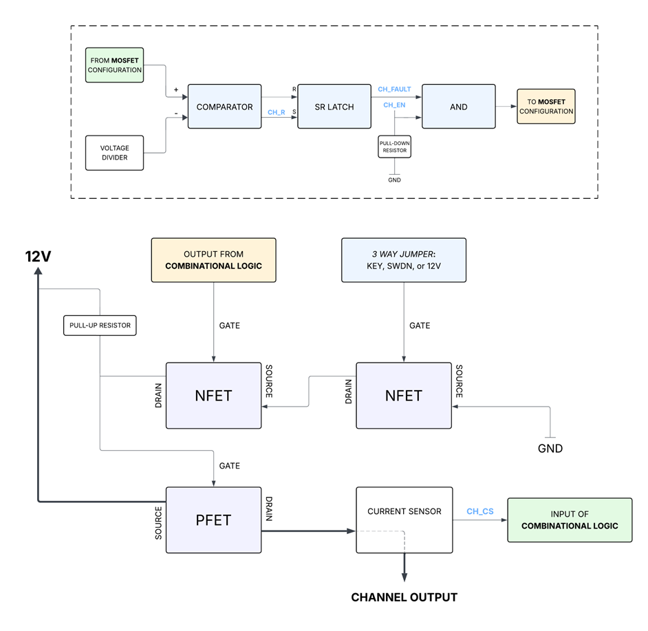

# Smart PDM
## Purpose

Smart Power Distribution Module (Smart PDM) is designed to manage and protect 12V power distribution within the car. It replaces traditional mechanical fuses and relays (Dumb PDM) with semiconductor-based switching and logic-driven fault detection. This is nice because it means faster response to electrical faults, improved reliability under comp-endurance-level conditions, and integration with vehicle communication systems (more fun stuff for software).

## Core Details

The three main components of Smart PDM’s architecture is current sensing, digital logic, and semiconductor switching. Here is a block diagram of the entire process:

 
<em>The light blue lettering are signals from the</em> microcontroller

To put it simply, there is a PFET whose gate is controlled by NFETs. Those gates are controlled by thresholds (hardware and software). It’s a straightforward process. In the event of a short, it is conducted at the current sensor and then the combinational logic closes the PFET gate to stop 12V from going to the rest of the car. As a summary, you know that in general PDM’s main responsibility is to safely distribute 12V from the battery to everything. Dumb PDM does this with solid-state relays and fuses. Smart PDM does this through software detection (hence the smart).

Refer to [extended documentation](https://cloud.wikis.utexas.edu/wiki/spaces/LHRC/pages/410845808/Power+Distribution+Module+PDM) in 02 - Projects, and the files in the GitHub for more info. 
