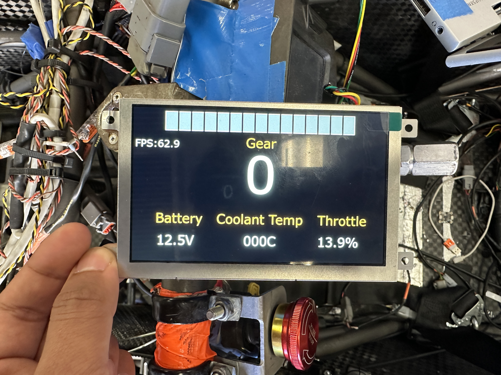

# Custom Display

##Purpose

Custom Display is a driver information display for the car, built on an STM32H7 microcontroller with a Riverdi LCD. The STM32 reads live data from the Haltech ECU over the car's CAN bus and renders it on-screen using [TouchGFX](https://support.touchgfx.com/docs/introduction/what-is-touchgfx), an embedded graphics library for STM32.

**Display hardware:** [https://riverdi.com/product/5-inch-tft-lcd-screen-stm32u5-embedded-display-rvt50hqsfwn01?srsltid=AfmBOoq_PbYSuQUkMhpmtfA5kOqO7L9fX0RrjbtiRxhyNDaXJeP7M8Rh](#)  
> 


---

## Overview

| Detail | Value |
|---|---|
| Microcontroller | STM32H7 |
| Display | Riverdi LCD |
| Graphics Library | TouchGFX |
| Language | C / C++ |
| RTOS | None (simplified loop via `Model::tick`) |
| Data Source | ECU via CAN bus |

---

## Architecture

All code is written in C style but integrates with TouchGFX, a C++ library. There is no RTOS — the update loop runs entirely inside `Model::tick` for simplicity.

### Data Flow

```
CAN Bus (mostly ECU though it can be anything on CAN bus)
    │
    ▼
CAN Interrupt (main.c)
    │  updates
    ▼
can_types.cpp  ──  UI data elements & handlers
-----
Model.cpp      ──  data update tick
    │
    ▼
Screen1Presenter.cpp
    │
    ▼
Screen1View.cpp  ──  UI element rendering
```

### Key Files

| File | Role |
|---|---|
| `main.c` | CAN interrupt setup; `RxFifo0Callback` routes incoming CAN frames |
| `can_types.hpp` | Declares CAN value types, IDs, default values, etc|
| `can_types.cpp` | Defines CAN values and the `CAN_value_ptrs` array |
| `Model.cpp` | Polls updated CAN data each tick and forwards to presenter |
| `Screen1Presenter.cpp` | Mediates between model and view |
| `Screen1View.cpp` | Updates UI elements; handles special visual logic |

---

## Contributing

The TouchGFX tutorials and docs are pretty good for understanding how it works. Also, I used CubeMX to generate code, TouchGFX Designer to generate UI code, CMake to build, and VSCode Arm Cortex Debug for flash/debug. Read the [Adding New Display Item](adding_new_display_item.md) page for a step-by-step guide on adding a new item to the display.
